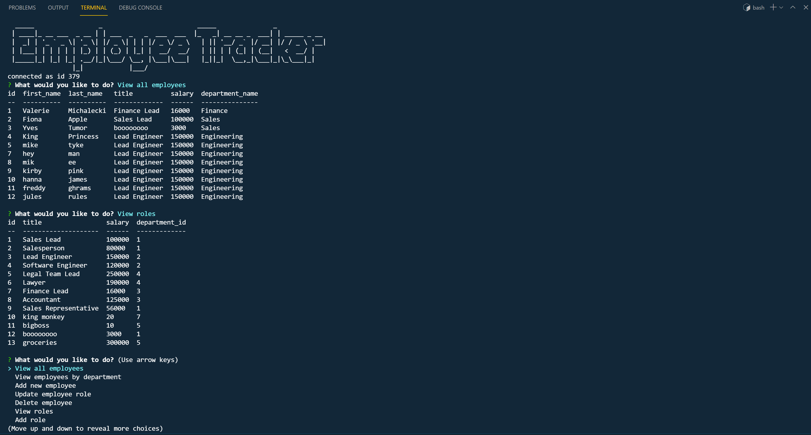

## Employee Tracker

## Description

This command-line Content Management System is a solution for managing the database of a company's employees using Node.js, Inquirer, and mySQL.

## Table of Contents

* [Installation](#Installation)
* [Usage](#Usage)
* [License](#License)
* [Questions](#Questions)
* [Acknowledgements](#Acknowledgements)
* [Screenshots](#Screenshots)

## Installation

Follow these steps to install the Employee Tracker:
    1. Create your database with the help of the `schema.sql` file.
    2. Run `npm i` in your terminal to install all of the packages required.
    3. Create a .env file and populate it:
        * DB_NAME=employees_db
        * DB_USER=root
        * DB_PASSWORD='enter user password'

## Usage

Follow these steps to use the Employee Tracker:
    1. Run `npm start` or `node server` to load your menu of options.
    2. Select an action item.

## License

MIT

## Questions

For additional information please contact me via GitHub at [https://github.com/malicea0783](https://github.com/malicea0783) or via email at [malicea0783@gmail.com](mailto:malicea0783@gamil.com?subject=[GitHub]%Employee%Tracker).

## Acknowledgements

Miguel Alicea: [https://github.com/vmichalecki](https://github.com/vmichalecki)

## Screenshots

